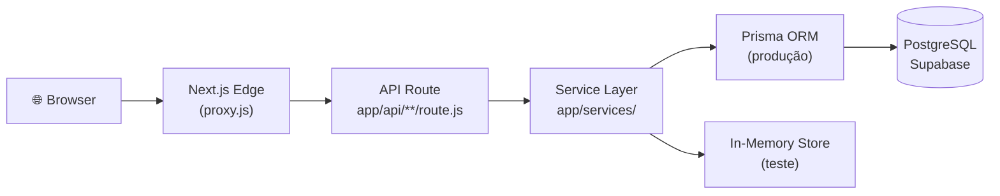
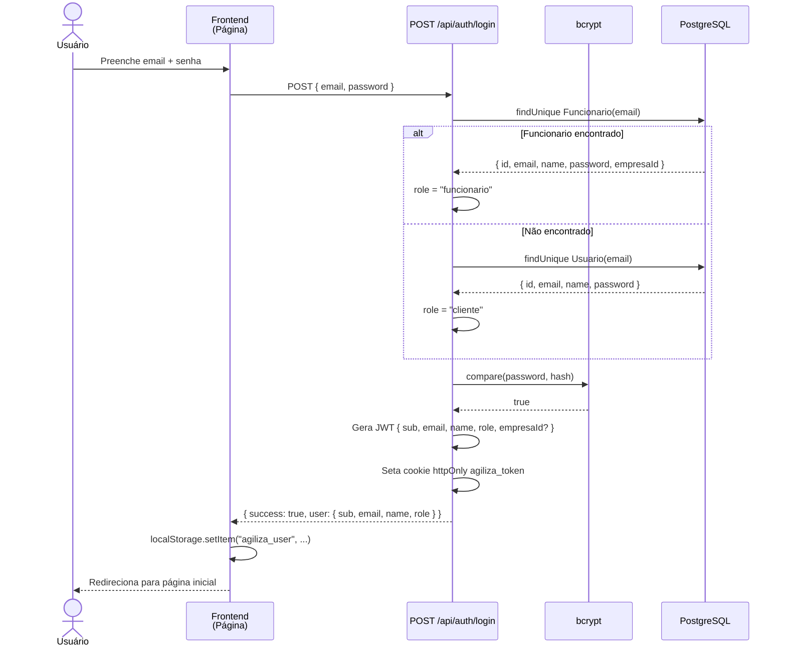
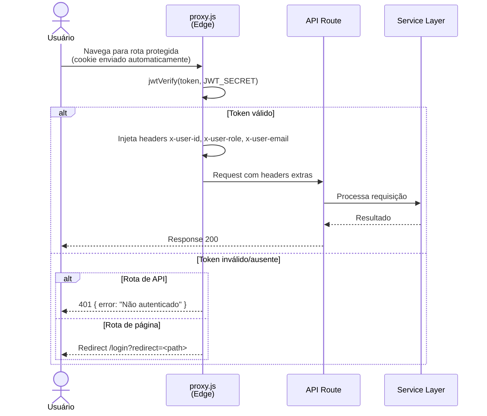
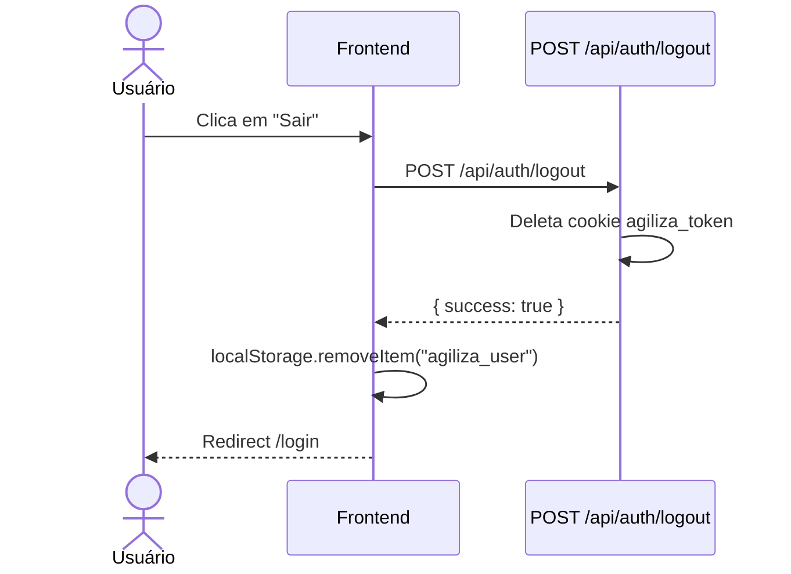
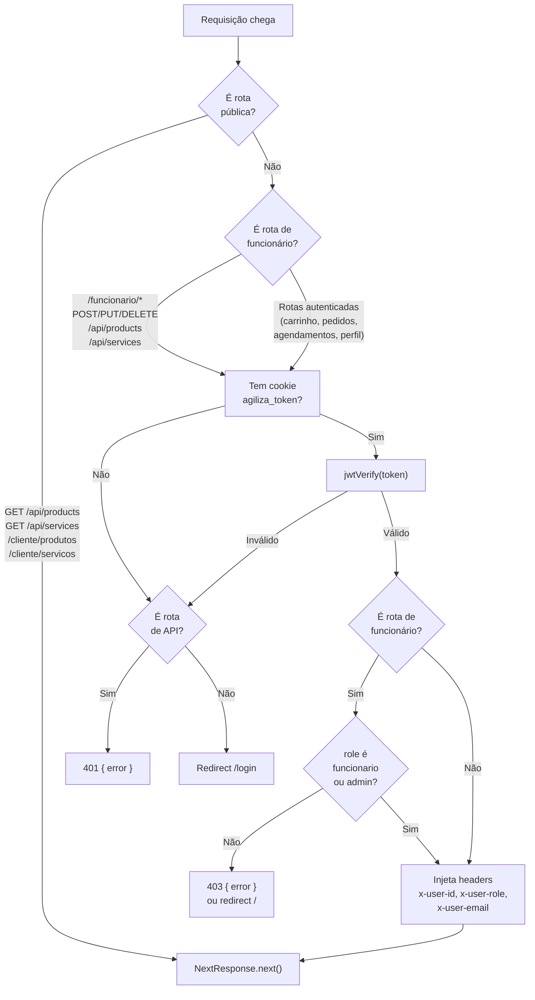
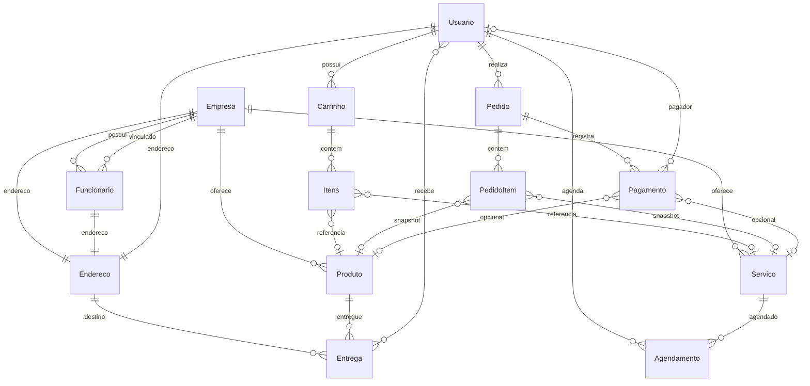

# Arquitetura

## Visão Geral

Agiliza é uma aplicação full-stack construída com Next.js 16 App Router. O backend e frontend estão no mesmo projeto: o diretório `app/api/` contém as rotas de API (backend), e os demais diretórios em `app/` são páginas React (frontend). A autenticação é feita via JWT armazenado em cookie httpOnly, verificada por um middleware Edge Runtime (`proxy.js`).



## Estrutura de Camadas

### 1. Middleware (`proxy.js`)

Roda no Edge Runtime do Next.js para todas as requisições a rotas protegidas (definidas no `config.matcher`). Funções:

- Verificar JWT do cookie `agiliza_token` usando `jose`
- Rotas públicas: GET em `/api/products` e `/api/services`, páginas `/cliente/produtos` e `/cliente/servicos`
- Rotas de funcionário: `/funcionario/*`, `/api/services` (mutação), `/api/products` (mutação) — exigem role `funcionario` ou `admin`
- Rotas de empresa: `/api/empresa/*`, `/empresa/*` — exigem role `empresa`, `funcionario` ou `admin`
- Rotas autenticadas: `/api/appointments`, `/api/cart`, `/api/orders`, `/api/cliente`, `/cliente/carrinho`, `/cliente/pedidos`, `/cliente/agendamentos` — exigem qualquer usuário logado
- Injeta headers `x-user-id`, `x-user-role`, `x-user-email` na request quando o token é válido

Sem token:
- Rota de API → retorna `401` JSON
- Rota de página → redireciona para `/login?redirect=<path>`

### 2. API Routes (`app/api/**/route.js`)

Cada rota exporta funções nomeadas (`GET`, `POST`, `PUT`, `PATCH`, `DELETE`) que recebem `Request` e retornam `Response`. Padrão interno:

```js
const useMemoryStore = process.env.NODE_ENV === "test"
```

Quando `useMemoryStore` é `true` (ambiente de teste), as operações usam arrays em memória de `app/data/store.js`. Quando `false` (produção/desenvolvimento), usam Prisma.

As rotas leem os headers injetados pelo `proxy.js` para identificar o usuário:
- `request.headers.get("x-user-id")` — ID do usuário autenticado
- `request.headers.get("x-user-role")` — role (`cliente` ou `funcionario`)
- `request.headers.get("x-user-email")` — email do usuário

### 3. Serviços (`app/services/`)

Camada de validação e regras de negócio, separada das rotas para testabilidade:

| Classe | Métodos | Responsabilidade |
|---|---|---|
| `ProductService` | `validateProduct(data)` | Validar nome, preço, descrição de produto |
| `ServiceService` | `validateService(data)` | Validar nome, preço, dias/horários disponíveis |
| `CartService` | `addItem()`, `removeItem()`, `calculateTotal()` | Operações no carrinho in-memory |
| `AppointmentService` | `validateDate()`, `validateConflict()`, `validateAppointment()` | Validações de agendamento |

### 4. Acesso a Dados

**Produção**: Prisma Client conectado ao PostgreSQL no Supabase via `@prisma/adapter-pg`.

**Teste**: Arrays em memória em `app/data/store.js`. Cada rota decide qual usar baseado em `process.env.NODE_ENV`.

```js
// Prisma — singleton
import { PrismaClient } from "../../generated/prisma/client"
import { PrismaPg } from "@prisma/adapter-pg"

const adapter = new PrismaPg({ connectionString: process.env.DATABASE_URL })
export const prisma = globalThis.prisma ?? new PrismaClient({ adapter })
if (process.env.NODE_ENV !== "production") globalThis.prisma = prisma
```

### 5. Frontend (Páginas)

Páginas React com Server Components (padrão) e Client Components (quando necessário para interatividade).

**Client Components**: `Navbar.jsx`, `ThemeToggle.jsx`, componentes de página com `"use client"` (carrinho, pedidos, formulários, etc.)

**Páginas públicas**: Landing page (`/`), produtos (`/cliente/produtos`), serviços (`/cliente/servicos`), login (`/login`), registro (`/register`)

**Páginas autenticadas (cliente)**: Carrinho (`/cliente/carrinho`), pedidos (`/cliente/pedidos`), agendamentos (`/cliente/agendamentos`), configurações (`/cliente/configuracoes`)

**Páginas de funcionário**: Gerenciar produtos (`/funcionario/produtos`), gerenciar serviços (`/funcionario/servicos`)

**Páginas de empresa**: Dashboard (`/empresa/dashboard`) com cards métricos e gráficos, gerenciar funcionários (`/empresa/funcionarios`)

## Fluxo de Autenticação

### Login



### Requisição Autenticada



### Logout



### Proteção de Rotas (proxy.js)



### Por que localStorage para o user?

O cookie é httpOnly (não acessível por JavaScript). O frontend não consegue ler o JWT para exibir nome e links por role. Por isso o payload é duplicado no `localStorage` apenas para UI. A segurança real vem do cookie verificado no proxy.js.

## Componentes e UI

- Componentes compartilhados em `app/components/` (Navbar, Footer, Logo, ThemeToggle)
- Componentes shadcn/ui em `app/components/ui/` — importar com caminho relativo ou `@/app/components/ui/`
- Utilitário `cn()` em `app/lib/utils.js` para mesclar classes (`clsx` + `tailwind-merge`)
- Notificações toast via `sonner` (`<Toaster />` no layout raiz, `toast.error()`/`toast.success()` nas páginas) — substitui o antigo hook `useAlert.js` que foi removido
- Gráficos do dashboard com `recharts` + componente `Chart` (shadcn/ui) em `app/components/ui/chart.jsx`

## Aliases de Import

Configurado em `vitest.config.js` e `jsconfig.json`:

```js
"@/*" → "./*"
```

Uso: `import { Button } from "@/app/components/ui/button"`

## Modo Teste vs Produção

**CRÍTICO**: O padrão `useMemoryStore` não deve ser removido. Testes do Vitest não têm ambiente Next.js completo — `cookies()` e Prisma real não funcionam. Cada rota de API verifica `process.env.NODE_ENV === "test"` para decidir se usa a store in-memory ou o Prisma.

As rotas têm duas implementações que coexistem:
- Cart: in-memory usa `{ id, name, price }` diretamente; produção usa `{ produtoId, quantity }`
- Orders/Appointments: mesma lógica de negócio, mudando apenas a origem dos dados

## Schema do Banco

15 modelos no total. Principais entidades e seus relacionamentos:



| Entidade | Descrição |
|---|---|
| `Usuario` | Cliente da plataforma |
| `Funcionario` | Funcionário vinculado a uma `Empresa` |
| `Empresa` | Empresa dona dos produtos e serviços |
| `Produto` | Produto à venda (exclusão lógica via `active`) |
| `Servico` | Serviço agendável (com `availableDays`, `startTime`, `endTime`) |
| `Carrinho` + `Itens` | Carrinho de compras do usuário |
| `Pedido` + `PedidoItem` | Pedido finalizado com snapshot de preços |
| `Agendamento` | Agendamento de serviço (unique: servicoId + scheduledAt) |
| `Pagamento` | Registro de pagamento |
| `Endereco` | Endereço compartilhado entre Usuario, Funcionario, Empresa |
| `Entrega` | Entrega de produto em endereço |
| `Auditoria` | Log de alterações em dados sensíveis |

Schema completo em `prisma/schema.prisma`.
