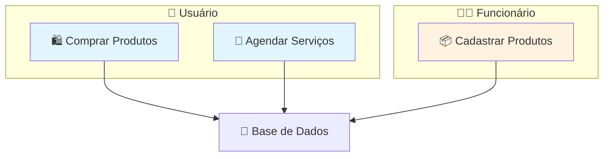
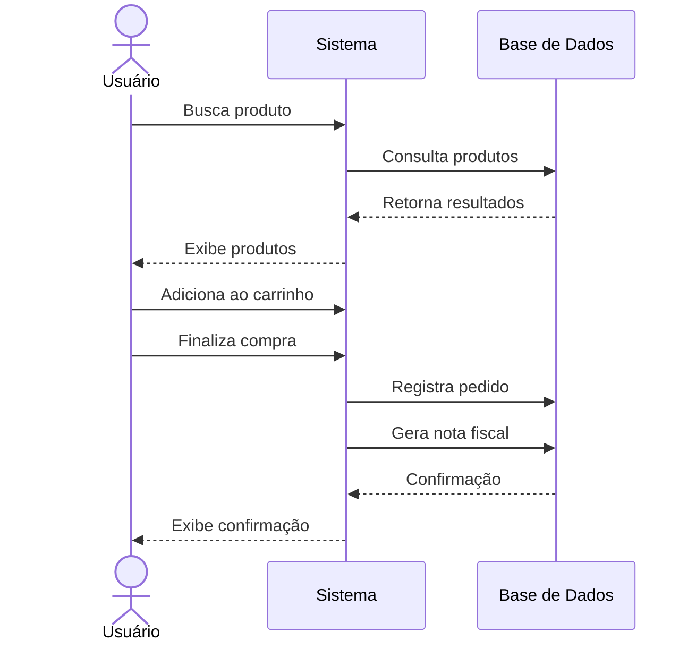
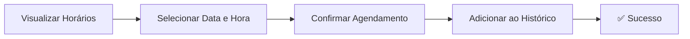
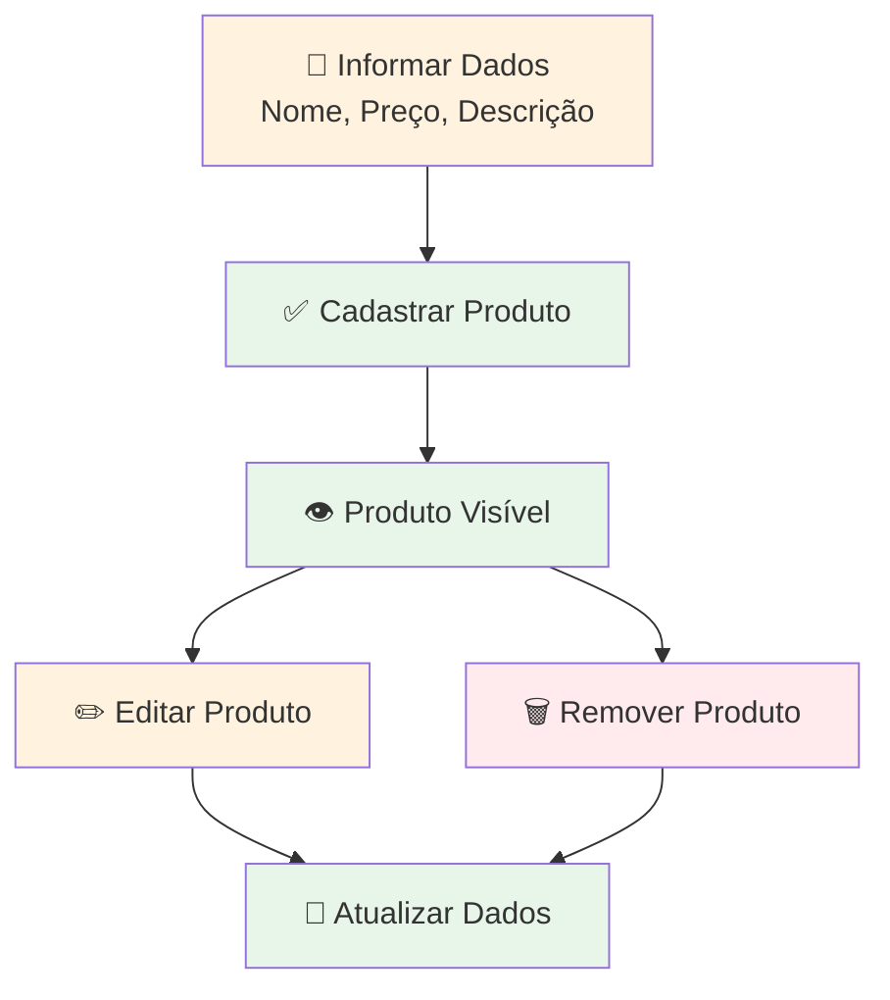
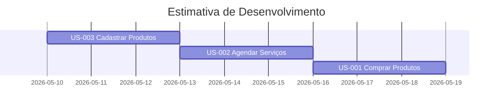

# Histórias de Usuário - Agiliza

## 📋 Sumário

- [Visão Geral](#visão-geral)
- [Diagrama de Funcionalidades](#diagrama-de-funcionalidades)
- [Histórias Detalhadas](#histórias-detalhadas)
  - [US-001: Comprar Produtos](#us-001-comprar-produtos)
  - [US-002: Agendar Serviços](#us-002-agendar-serviços)
  - [US-003: Cadastrar Produtos](#us-003-cadastrar-produtos)

---

## 🎯 Visão Geral

Este documento contém as histórias de usuário do sistema Agiliza, descrevendo as funcionalidades principais da plataforma e seus critérios de aceitação.

### Resumo das Histórias

| ID | Título | Ator | Prioridade | Estimativa |
|---|---|---|---|---|
| US-001 | Comprar Produtos | Usuário | Alta | 8 pts |
| US-002 | Agendar Serviços | Usuário | Alta | 5 pts |
| US-003 | Cadastrar Produtos | Funcionário | Alta | 3 pts |

---

## 📊 Diagrama de Funcionalidades

---

## 📖 Histórias Detalhadas

### US-001: Comprar Produtos

**Tipo de Ator:** Usuário da Plataforma

**Descrição:** Como usuário da plataforma, eu quero buscar e comprar produtos, para que eu possa adquiri-los de forma prática online.

**Metadados:**
- **Prioridade:** Alta
- **Estimativa:** 8 pontos

**Critérios de Aceitação:**

- [ ] O usuário deve poder buscar produtos por nome ou categoria
- [ ] O usuário deve poder adicionar produtos ao carrinho
- [ ] O usuário deve poder finalizar a compra
- [ ] O sistema deve registrar o pedido no histórico do usuário e gerar uma nota fiscal

**Fluxo de Compra:**

---

### US-002: Agendar Serviços

**Tipo de Ator:** Usuário da Plataforma

**Descrição:** Como usuário da plataforma, eu quero agendar serviços, para que eu possa escolher horários disponíveis de acordo com minha necessidade.

**Metadados:**
- **Prioridade:** Alta
- **Estimativa:** 5 pontos

**Critérios de Aceitação:**

- [ ] O usuário deve visualizar os horários disponíveis
- [ ] O usuário deve poder selecionar data e hora
- [ ] O sistema deve confirmar o agendamento
- [ ] O agendamento deve aparecer no histórico do usuário

**Fluxo de Agendamento:**

---

### US-003: Cadastrar Produtos

**Tipo de Ator:** Funcionário

**Descrição:** Como funcionário, eu quero cadastrar produtos loja em que eu trabalho, para que eles fiquem disponíveis para venda.

**Metadados:**
- **Prioridade:** Alta
- **Estimativa:** 3 pontos

**Critérios de Aceitação:**

- [ ] O funcionário deve informar nome, preço e descrição do produto
- [ ] O produto deve ficar visível para os usuários
- [ ] O funcionário deve poder editar produtos cadastrados
- [ ] O funcionário deve poder remover produtos

**Fluxo de Gerenciamento de Produtos:**

---

## 📈 Roadmap Resumido

---

**Última Atualização:** 27 de abril de 2026