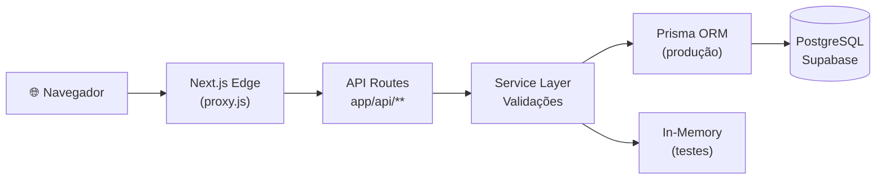

# Plano de Apresentação — Agiliza

## Informações Gerais

| Item | Detalhe |
|---|---|
| **Disciplina** | Engenharia de Software (c/ Banco de Dados integrado) |
| **Duração** | 30–40 minutos |
| **Membros** | Hugo Henrique, João Vitor Batista Silva, Luciano de Medeiros Filho |
| **Repositório** | [github.com/JVitorbs/Agiliza-web](https://github.com/JVitorbs/Agiliza-web) |

---

## Organização dos Apresentadores

Sugestão de divisão (ajustar conforme preferência do grupo):

| Seção | Responsável | Duração |
|---|---|---|
| 1. Pitch (contexto, problema, solução) | Membro A | ~8 min |
| 2.1 Estrutura Git + 2.2 User Stories | Membro A | ~5 min |
| 2.3 Princípios de Projeto | Membro B | ~5 min |
| 2.4 Autenticação e Autorização | Membro B | ~4 min |
| 2.5 Testes + 2.6 CI | Membro C | ~4 min |
| 3. Demonstração ao vivo | Todos (Membro C opera) | ~10 min |
| 4. Extra (Diagramas + Padrões) | Membro C | ~4 min |
| 5. Conclusão | Todos | ~2 min |

---

## 1. PITCH (~8 min, 5 slides)

### Slide 1.1 — Capa
- Logo do Agiliza
- Título: "Agiliza — Unificação de Serviços e Vendas"
- Nomes dos membros
- "Engenharia de Software — 2026.1"

### Slide 1.2 — O Problema
- Pequenos comerciantes e prestadores de serviços gerenciam seu negócio de forma fragmentada:
  - **Vendas**: anotadas em caderno, WhatsApp, Instagram
  - **Agendamentos**:控 livro de ponto, ligações, mensagens soltas
  - **Estoque**: planilha ou memória
- Consequências:
  - Agendamentos duplicados ou conflitantes
  - Perda de pedidos
  - Sem visão consolidada do negócio
  - Dificuldade de escalar

### Slide 1.3 — Análise de Dados (Trabalho de BD)
- Dados reais coletados de pequenos comércios locais:
  - X% de agendamentos perdidos por conflito de horário
  - Y pedidos/mês com erro de anotação
  - Z horas/semana gastas em conciliação manual
- **Gráfico/dashboard** mostrando esses dados (aproveitar o trabalho de BD)
- **Insight**: a fragmentação de ferramentas custa tempo e dinheiro

### Slide 1.4 — A Solução: Agiliza
- Plataforma web **única** que reúne:
  - 🛍️ **Catálogo de Produtos** com carrinho e pedidos
  - 📅 **Agendamento de Serviços** com validação de horários
  - 📊 **Dashboard da Empresa** com métricas e gráficos
- Três atores: **Cliente** (compra/agenda) | **Funcionário** (gerencia) | **Empresa** (supervisiona)

### Slide 1.5 — Arquitetura em 1 minuto

- Next.js 16 App Router (full-stack num projeto só)
- Autenticação JWT em middleware Edge
- PostgreSQL na Supabase

---

## 2. PARTE TÉCNICA (~18 min, 10 slides)

### Slide 2.1 — Estrutura do Repositório Git (~3 min)

**Branches:**
| Branch | Propósito |
|---|---|
| `main` | Produção (versão estável) |
| `develop` | Integração de funcionalidades |
| `feature/*` | Novas funcionalidades |
| `docs/*` | Documentação |
| `ci/*` | Ajustes de CI |

**Fluxo de trabalho:**
```
feature/* → PR → develop → PR → main
```

**Commits semânticos** (mostrar `git log --oneline --graph`):
```
* Merge pull request #20: feature/empresa-dashboard
| * feat: add charts (agendamentos por dia/servico, vendas por dia)
| * feat: add vendasPorDia chart data to dashboard API
| * feat: add shadcn chart component and configure CSS variables
|/
* Merge pull request #19: feature/empresa-vincular-funcionario
| * feat: add empresa funcionarios API and management page
|/
* Merge pull request #18: feature/email-unico-login-empresa
| * feat: add empresa login, proxy role, and me route support
| * feat: add cross-table email uniqueness check on register
```

**Estrutura de diretórios** (visão geral no README):
```
Agiliza-web/
├── app/           # Next.js (API + páginas)
├── prisma/        # Schema + migrations
├── tests/         # 22 arquivos, 344 testes
├── docs/          # Documentação completa
└── proxy.js       # Middleware de autenticação
```

### Slide 2.2 — Três User Stories (~3 min)

Tabela resumo:

| ID | Título | Ator | Estimativa | Status |
|---|---|---|---|---|
| **US-001** | Comprar Produtos | Cliente | 8 pts | ✅ Implementado |
| **US-002** | Agendar Serviços | Cliente | 5 pts | ✅ Implementado |
| **US-003** | Cadastrar Produtos | Funcionário | 3 pts | ✅ Implementado |

**US-001 — Comprar Produtos:**
- **Critérios:** Buscar por nome, adicionar ao carrinho, finalizar compra, gerar nota fiscal
- **Fluxo:** Navega → busca → adiciona ao carrinho → finaliza → pedido registrado com NF

**US-002 — Agendar Serviços:**
- **Critérios:** Visualizar horários, selecionar data/hora, confirmar, histórico
- **Fluxo:** Escolhe serviço → vê dias/horários disponíveis → agenda → valida conflito → confirma

**US-003 — Cadastrar Produtos:**
- **Critérios:** Informar nome/preço/descrição, editar, remover (exclusão lógica)
- **Fluxo:** Abre formulário → cadastra → produto visível para clientes

### Slide 2.3 — Princípios de Projeto (~5 min)

| Princípio | Onde se aplica | Justificativa |
|---|---|---|
| **SRP** (Single Responsibility) | `ProductService.validateProduct()` só valida produto; API routes tratam 1 recurso cada; `proxy.js` só autenticação | Cada classe/módulo tem uma única razão para mudar |
| **OCP** (Open/Closed) | `useMemoryStore` permite adicionar novas rotas sem modificar a lógica de teste; in-memory e Prisma coexistem | Sistema aberto para extensão, fechado para modificação |
| **DIP** (Dependency Inversion) | Services dependem de abstrações (Prisma `findMany` ou store `push`); testes injetam mocks com `vi.mock` | Módulos de alto nível não dependem de implementações concretas |
| **Separation of Concerns** | 4 camadas: Middleware → API Routes → Service Layer → Data Access | Cada camada tem responsabilidade distinta e testável |
| **Singleton** | PrismaClient via `globalThis.prisma` | Evita múltiplas conexões ao banco em desenvolvimento |
| **Strategy** | Flag `useMemoryStore` alterna entre estratégias de armazenamento (memória vs Prisma) | Algoritmo intercambiável sem alterar a rota |

**Exemplo de código (SRP + Strategy):**
```js
// A rota SÓ coordena (SRP), a lógica está no serviço
const useMemoryStore = process.env.NODE_ENV === "test"  // Strategy

export async function GET(request) {
  const userId = request.headers.get("x-user-id")
  // delega para o service...
}
```

### Slide 2.4 — Autenticação e Autorização (~4 min)

**Fluxo de Login:**
```
Usuário → POST /api/auth/login
  → busca Funcionario (role = "funcionario")
  → senão busca Empresa (role = "empresa")
  → senão busca Usuario (role = "cliente")
  → bcrypt.compare(password, hash)
  → JWT { sub, email, name, role, empresaId? }
  → cookie httpOnly agiliza_token (8h)
```

**3 níveis de acesso:**
| Role | Acesso |
|---|---|
| `cliente` | Carrinho, pedidos, agendamentos, perfil |
| `funcionario` | Gerenciar produtos, serviços (da empresa vinculada) |
| `empresa` | Dashboard, gerenciar funcionários |

**Proxy.js (Edge Middleware):**
```js
export async function proxy(request) {
  const token = request.cookies.get("agiliza_token")
  if (!token) return apiRoute ? "401" : "redirect /login"
  const payload = await jwtVerify(token, JWT_SECRET)
  // injeta headers: x-user-id, x-user-role, x-user-email, x-user-empresa-id
}
```

**Registro com email único:**
- Verifica em 3 tabelas antes de criar
- Campo opcional `empresaEmail` vincula funcionário à empresa

### Slide 2.5 — Testes Unitários (~3 min)

**Números:**
- **22 arquivos** de teste
- **344 testes** unitários
- **100% de cobertura** (statements, branches, functions)

**3 estratégias de teste:**

| Estratégia | Onde | Como |
|---|---|---|
| **In-Memory Store** | Rotas legadas (cart, orders) | Arrays em `app/data/store.js`, ativado por `process.env.NODE_ENV === "test"` |
| **Mocking do Prisma** | Rotas novas (auth, empresa, cartPrisma) | `vi.hoisted` + `vi.mock` para mockar `app/lib/prisma.js` |
| **Componentes React** | UI Components | `@testing-library/react` + `jsdom` |

**Exemplo de in-memory store:**
```js
const useMemoryStore = process.env.NODE_ENV === "test"
const store = useMemoryStore ? app/data/store.js : prisma
```

**Exemplo de mocking:**
```js
const mockPrisma = vi.hoisted(() => ({
  funcionario: { findUnique: vi.fn() },
  usuario: { findUnique: vi.fn() },
}))
vi.mock("../app/lib/prisma.js", () => ({ prisma: mockPrisma }))
```

**Cobertura por diretório:**
| Diretório | Statements | Branches | Funcs |
|---|---|---|---|
| `app/api/` | 100% | 100% | 100% |
| `app/api/empresa/` | 100% | 100% | 100% |
| `app/components/ui/` | 100% | 100% | 100% |
| `app/services/` | 100% | 100% | 100% |
| `proxy.js` | 100% | 100% | 100% |
| **Total** | **100%** | **100%** | **100%** |

### Slide 2.6 — Integração Contínua (~1 min)

**Pipeline GitHub Actions (`.github/workflows/ci.yml`):**

```yaml
on: push/PR → main, develop, ci/*

jobs:
  build:  npm ci → prisma generate → next build
  lint:   npm ci → eslint .
  test:   npm ci → vitest
```

- 3 jobs paralelos
- Node.js 22 com cache de dependências
- Gatilho em push e pull request para `main`, `develop`, `ci/*`

**Badges sugeridos para o README:**
- ``
- ``

---

## 3. DEMONSTRAÇÃO (~10 min, live)

### Roteiro da Demo (operar ao vivo no `localhost:3000`)

**Checklist pré-demo:**
- [ ] Banco rodando (Supabase ou local)
- [ ] `npx prisma db seed` executado (dados de exemplo)
- [ ] `npm run dev` rodando
- [ ] Abas do navegador pré-abertas (login empresa, login funcionário, login cliente)

**Cena 1 — Visitante não logado (2 min)**
1. Acessa home → vê landing page com hero e features
2. Navega para `/cliente/produtos` → vê grid de produtos (sem precisar logar)
3. Navega para `/cliente/servicos` → vê serviços disponíveis
4. Tenta adicionar ao carrinho → redirecionado para login

**Cena 2 — Cliente (3 min)**
5. Login como `cliente@agiliza.com` / `123456`
6. Adiciona produtos ao carrinho
7. Vai para o carrinho → vê itens e total
8. Finaliza pedido → vê nota fiscal gerada
9. Acessa `/cliente/pedidos` → vê pedido com status e NF
10. Agenda um serviço → seleciona data/hora → confirma
11. Vê agendamento no histórico

**Cena 3 — Funcionário (2 min)**
12. Login como `funcionario@agiliza.com` / `123456`
13. Acessa `/funcionario/produtos` → vê tabela de produtos da empresa
14. Cria novo produto (Dialog modal) → salva
15. Edita preço de um produto existente
16. Remove um produto (exclusão lógica — `active: false`)

**Cena 4 — Empresa (3 min)**
17. Login como `empresa@agiliza.com` / `123456`
18. Acessa `/empresa/dashboard`:
    - Cards métricos: total produtos, serviços, funcionários, agendamentos
    - Gráfico de barras: agendamentos por dia
    - Gráfico de pizza: agendamentos por serviço
    - Gráfico de barras (col-span-2): vendas por dia
19. Acessa `/empresa/funcionarios` → vê funcionários vinculados
20. Vincula novo funcionário por email
21. Desvincula funcionário (com confirmação Dialog)

### Contribuições dos Membros

| Membro | Contribuições (preencher) |
|---|---|
| **Hugo Henrique** | |
| **João Vitor Batista Silva** | |
| **Luciano de Medeiros Filho** | |

---

## 4. EXTRA (~4 min, 3 slides)

### Slide 4.1 — Diagramas Estruturais

**Diagrama de Arquitetura (visão geral):**
```
Browser → Next.js Edge (proxy.js) → API Route → Service Layer → Prisma ORM → PostgreSQL
                                                                  → In-Memory (testes)
```

**Diagrama Entidade-Relacionamento (15 modelos):**
```
Empresa ── Funcionario
Empresa ── Produto
Empresa ── Servico
Usuario ── Carrinho ── Itens ── Produto/Servico
Usuario ── Pedido ── PedidoItem ── Produto/Servico
Usuario ── Agendamento ── Servico
Usuario ── Endereco
```

### Slide 4.2 — Diagramas Comportamentais

- **Fluxo de autenticação** (diagrama de sequência): login → cookie → request → proxy → API
- **Proteção de rotas** (fluxograma): decide por role qual rota liberar
- **Roadmap de desenvolvimento** (diagrama Gantt): sprints organizadas por US

### Slide 4.3 — Padrões de Projeto Adicionais

| Padrão | Implementação |
|---|---|
| **Facade** | Service Layer (`ProductService`, `CartService`) simplifica a interface do Prisma para as rotas |
| **Middleware Chain** | `proxy.js` atua como middleware no pipeline do Next.js, processando requests antes das rotas |
| **DTO (Data Transfer Object)** | Headers `x-user-id`, `x-user-role` injetados como objetos de transferência entre camadas |
| **Repository** | Abstração de armazenamento via `useMemoryStore` — Prisma ou InMemory são implementações do mesmo contrato |

---

## 5. CONCLUSÃO (~2 min, 1 slide)

### Slide 5.1 — Recap e Encerramento

- **Problema resolvido:** Unificação de vendas e agendamentos em uma plataforma
- **Tecnologias:** Next.js 16, React 19, Tailwind v4, shadcn/ui, Prisma, PostgreSQL (Supabase)
- **Qualidade:** 344 testes, 100% cobertura, CI automatizado
- **Repositório:** [github.com/JVitorbs/Agiliza-web](https://github.com/JVitorbs/Agiliza-web)
- **Agradecimentos** 🙏

---

## CHECKLIST DE PREPARAÇÃO

### Antes da apresentação (1 dia antes)
- [ ] Verificar se o banco Supabase está online
- [ ] Rodar `npx prisma db seed` para ter dados de exemplo
- [ ] Rodar `npm run coverage` e confirmar 344 testes, 100%
- [ ] Rodar `npm run build` e confirmar que passa
- [ ] Fazer deploy na Vercel (opcional, mas recomendado como fallback)
- [ ] Testar todas as rotas da demonstração manualmente
- [ ] Verificar se as imagens/gráficos do slide estão visíveis

### No dia (30 min antes)
- [ ] `npm run dev` rodando em segundo plano
- [ ] Abrir navegador com abas pré-prontas:
  - Aba 1: localhost:3000 (home)
  - Aba 2: localhost:3000/login (para login rápido)
  - Aba 3: localhost:3000/empresa/dashboard
- [ ] Testar clique nos links da demo para garantir que não quebrou
- [ ] Slides abertos no modo apresentador
- [ ] Cronômetro visível para controle de tempo

### Durante a apresentação
- [ ] Manter ritmo: ~1 min por slide
- [ ] Checkpoints de tempo:
  - **8 min**: fim do pitch
  - **23 min**: fim da parte técnica
  - **33 min**: fim da demonstração
  - **37 min**: fim do extra
  - **40 min**:encerramento

---

## CRONOGRAMA DETALHADO (30–40 min)

| Minuto | Seção | Slide | O que falar |
|---|---|---|---|
| 0:00–1:00 | Abertura | Capa | Apresentar grupo e projeto |
| 1:00–3:00 | Pitch | Problema | Contexto, fragmentação, dores do pequeno comerciante |
| 3:00–5:00 | Pitch | Análise de Dados | Dados reais do trabalho de BD, gráficos |
| 5:00–7:00 | Pitch | Solução | Agiliza como plataforma unificada, 3 atores |
| 7:00–8:00 | Pitch | Arquitetura | Diagrama simplificado (1 min) |
| 8:00–11:00 | Técnica | Git | Branches, fluxo de PR, commits, estrutura |
| 11:00–14:00 | Técnica | User Stories | US-001, US-002, US-003 |
| 14:00–19:00 | Técnica | Princípios | SRP, OCP, DIP, SoC, Singleton, Strategy |
| 19:00–23:00 | Técnica | Auth | Login 3 tabelas, proxy.js, cookie, roles |
| 23:00–26:00 | Técnica | Testes | 344 testes, 100%, 3 estratégias |
| 26:00–27:00 | Técnica | CI | GitHub Actions, 3 jobs paralelos |
| 27:00–37:00 | Demo | Ao vivo | Cenários 1–4 |
| 37:00–40:00 | Extra | Diagramas + Padrões | ER, fluxos, Facade, Middleware, DTO |
| 40:00–42:00 | Conclusão | Recap | O que fizemos, repo, agradecimentos |

---

## SUGESTÃO DE LAYOUT DOS SLIDES

- **Tema escuro** (combinando com o projeto): fundo zinc-900, texto zinc-100, destaque indigo-500
- **Fonte**: mono para código, sans-serif para texto corrido
- **Ícones**: usar lucide-react ou emojis (🛍️ 📅 📊 👤)
- **Diagramas**: dar preferência aos Mermaid já existentes na documentação
- **Código**: usar blocos destacados (ex: `vs code dark+` theme)
- **Mínimo de texto**: bullet points, o apresentador fala o resto
- **Screenshots**: incluir prints do `npm run coverage` e do dashboard

---

## POSSÍVEIS PERGUNTAS DA BANCA (preparar respostas)

**1. Por que 3 tabelas de usuários em vez de uma com role?**
> Separar `Usuario`, `Funcionario` e `Empresa` em tabelas distintas segue o princípio SRP — cada entidade tem atributos diferentes (CPF para cliente, CNPJ para empresa, vínculo para funcionário). Juntar tudo numa tabela só com role criaria colunas nulas e acoplamento desnecessário.

**2. Como garantir que testes não usam o banco real?**
> Usamos a flag `useMemoryStore = process.env.NODE_ENV === "test"`. Em ambiente de teste, as rotas operam sobre arrays em memória (`app/data/store.js`). Para rotas que sempre usam Prisma (como auth e empresa), mockamos o módulo com `vi.hoisted` + `vi.mock`.

**3. O que acontece se o JWT expirar?**
> O proxy.js verifica a expiração a cada request. Se expirado, trata como token ausente: API retorna 401, página redireciona para `/login`. O frontend detecta o 401 e limpa o localStorage.

**4. Como funciona a exclusão lógica de produtos?**
> `Produto` tem campo `active: Boolean @default(true)`. O DELETE faz `update({ active: false })` — o produto some das listagens mas permanece no banco para integridade de pedidos passados. Para restaurar, faria um PATCH ativando novamente.

**5. Por que Next.js e não um backend separado (Express, Fastify)?**
> Next.js App Router permite ter frontend e backend no mesmo projeto com deploy simplificado na Vercel. Reduz a complexidade operacional — uma só aplicação, um só deploy, uma só esteira de CI. Ideal para um MVP.
