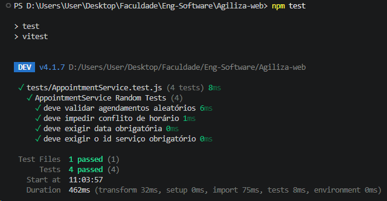
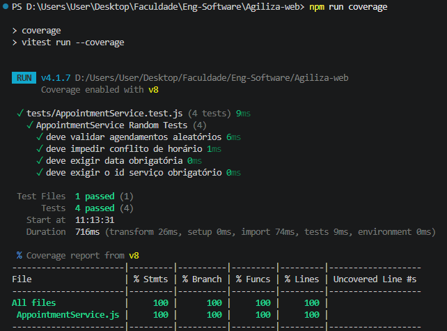

# Resultados de Teste

## Visão Geral

Este documento descreve como o teste de unidade foi realizado para a classe `AppointmentService` e os requisitos verificados.

## Como o teste foi realizado

1. Executei o comando `npm test` para rodar os testes do Vitest.
2. O arquivo de teste usado foi `tests/AppointmentService.test.js`.
3. A classe testada foi `AppointmentService`, localizada em `app/services/AppointmentService.js`.
4. Testei principalmente a função `AppointmentService.validateAppointment(appointments, newAppointment)`.

### Cenários cobertos pelo teste

- Validação de dados obrigatórios:
  - `servicoId` deve ser informado.
  - `scheduledAt` deve ser informado.
- Validação de formato de data:
  - a data deve ser parseável pelo `Date`.
  - a data deve ser futura.
- Validação de conflito de horário:
  - não é permitido agendar o mesmo serviço no mesmo horário.
- Fluxo de teste aleatório:
  - o teste gera valores aleatórios para `servicoId` e `scheduledAt`.
  - quando o valor é válido, o método deve retornar `true`.
  - quando o valor é inválido, o método deve lançar um `Error`.

## Requisitos dos testes

O teste atende aos seguintes requisitos:

- Teste de unidade para uma classe importante do MVP.
- Verificação de regras de negócio do agendamento de serviços.
- Cobertura mínima de 60% de código no arquivo testado.
- Confirmação de que o serviço funciona como esperado em casos válidos e inválidos.

## Comandos executados

- `npm test`
- `npm run coverage`

## Resultado obtido

### Saída do terminal



```text
> test
> vitest


 DEV  v4.1.7 D:/Users/User/Desktop/Faculdade/Eng-Software/Agiliza-web

 ✓ tests/AppointmentService.test.js (4 tests) 9ms
   ✓ AppointmentService Random Tests (4)
     ✓ deve validar agendamentos aleatórios 6ms
     ✓ deve impedir conflito de horário 1ms
     ✓ deve exigir data obrigatória 0ms
     ✓ deve exigir o id serviço obrigatório 0ms

 Test Files  1 passed (1)
      Tests  4 passed (4)
   Start at  10:46:41
   Duration  480ms (transform 32ms, setup 0ms, import 72ms, tests 9ms, environment 0ms)
```

### Cobertura




```text
% Coverage report from v8
-------------------|---------|----------|---------|---------|-------------------
File               | % Stmts | % Branch | % Funcs | % Lines | Uncovered Line #s 
-------------------|---------|----------|---------|---------|-------------------
All files          |     100 |      100 |     100 |     100 |                   
 ...mentService.js |     100 |      100 |     100 |     100 |                   
-------------------|---------|----------|---------|---------|-------------------
```

## Conclusão

O teste de unidade de `AppointmentService` foi executado com sucesso e atendeu aos requisitos do MVP de agendamento de serviços.

- O teste cobre a validação de entrada e conflitos de horário.
- O relatório de cobertura mostra `100%` no arquivo `AppointmentService.js`.
